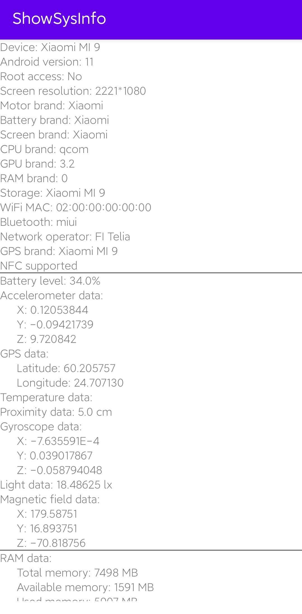

# show-system-info
<p align="center">
    <a href="https:/" target="_blank" rel="noopener noreferrer">
        
    </a>
</p>
Android package for viewing system's information.

**Keywords**: Android, APK, System monitor.

---
This is the screenshot of the app:

<p align="center">
    <a href="https:/" target="_blank" rel="noopener noreferrer">
        
    </a>
</p>

## Usage
Build the work with Android Studio and export as APK file, install it on your phone.
Or you can find the prebuild `.apk` file from [here](./res/app-debug-androidTest.apk)

### Repo structure
```bash
├── app
│   ├── build
│   │   ├── generated
│   │   ├── intermediates
│   │   ├── outputs
│   │   └── tmp
│   ├── libs
│   └── src
│       ├── androidTest
│       ├── main
│       └── test
├── gradle
│   └── wrapper
└── res
```
## Additions

Don't hesitate to open an issue if you find problem or request missing features.

## To do
- [x] Add icon for the app.
- [x] Refine layout.
- [x] Add more sensor's real-time value.
- [x] Add battery, storage, network, bluetooth, etc. information.
- [ ] Add pages and navigation bar, sorting info.
- [ ] Add sound meter.
